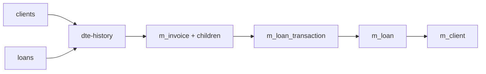

# Fiscal DTE history

This service imports the first reviewed Arissto DTE-history cohort into the
existing Fineract invoice model. It is an immutable history import, not an MH
submission workflow.



Version 1 includes only ordinary type `01` documents that have a legal
generation/control identity, normalized `facturacion` detail, one exact
`CRD_MOVIMIENTOS_CARTERA` bridge, a resolved `AFI_SOCIO.NUMERO_AFILIACION`, and
terminal legal evidence. Subject-excluded documents, code-less fiscal rows,
documents without the normalized projection, ambiguous loan links, and
non-terminal lifecycle rows remain outside this cohort.

The reviewed Arissto cohort leaves the two transmission-mode columns null. The
contract defaults both to the normal MH path (`tipoModelo=1`,
`tipoOperacion=1`) only when no contingency type or reason is present; any
contingency signal with missing modes is quarantined.

The import does not create an Arissto shadow table. Legal identity, receiver,
lines, totals, loan transaction, loan, and client live in the normal Fineract
model. `m_invoice` retains only the irreducible import origin, immutable source
hash, and raw lifecycle flags; `m_invoice_summary.total_iva` holds ordinary IVA
as a first-class fiscal value.

The service is registered as `blocked` but executable so it can participate in
reviewed local workflows while Loans remains gated. Promote it to `available`
only after confirming `target.ambiente`, applying Liquibase migration 0335, and
completing a full local apply, exact reconciliation, and unchanged replay.

```bash
./arissto-sync inspect --block dte-history --target local
./arissto-sync plan --block dte-history --target local
./arissto-sync apply --plan PLAN_ID --target local --dte-workers 2 --dte-batch-size 500
./arissto-sync reconcile --run RUN_ID --target local
./arissto-sync plan --block dte-history --target local
```

The second plan must contain only `unchanged` and reviewed quarantines. Retry
failed records with `./arissto-sync retry --run RUN_ID --failed-only --target local`.

The writer processes deterministic generation-code batches with two workers and
500 invoice aggregates per transaction by default. Each worker owns its
PostgreSQL connection; only the coordinator writes the SQLite checkpoint. A
failed transaction is rolled back and recursively split until the invalid DTE
is isolated, while valid siblings are committed and checkpointed. Operators may
select 1–4 workers and batch sizes from 1–2,000 using `--dte-workers` and
`--dte-batch-size`; the same values are frozen into workflow plans. Environment
defaults are `ARISSTO_SYNC_DTE_WORKERS` and `ARISSTO_SYNC_DTE_BATCH_SIZE`.

Source evidence is owned by the exploration note
`credesal-db-space/docs/learnings/fiscal-dte.md`; the executable mapping and
safety boundary are defined in [contract.md](contract.md).
