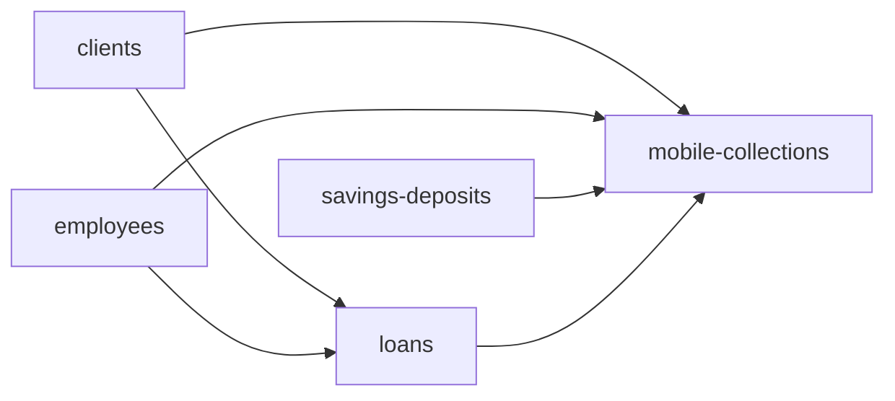

# Mobile collections

This executable dependent block preserves the operational history of Arissto
Cobro Movil without creating a second financial lifecycle.

It migrates:

- field routes from `MCD_RUTA`;
- party-to-route assignments from `MCD_ASIGNACION_RUTA`;
- exact product-account-to-route assignments from `dbo.cuenta`;
- daily collection batches from `MCD_MST_COBRODIARIO`; and
- captured collection items and their application references from
  `MCD_MOV_COBRODIARIO` and `MCD_MOVIMIENTOS`.

The authoritative repayment remains the native Fineract loan transaction
created by `loans`. This service stores operational metadata and links an
applied item to that transaction when the source relationship can be resolved
confidently. It creates no repayment, journal entry, teller transaction, or
cashier transaction.

## Destination

Liquibase migrations `0291_add_arissto_mobile_collections.xml` and
`0303_add_mobile_collection_account_assignments.xml` create five Credesal
extension tables. Migration
`0305_enable_native_mobile_collection_routes.xml` then permits native
API-created routes to coexist with migrated Arissto routes without assigning a
false Arissto identity:

- `credesal_mobile_collection_route`;
- `credesal_mobile_collection_assignment`;
- `credesal_mobile_collection_account_assignment`;
- `credesal_mobile_collection_batch`; and
- `credesal_mobile_collection_item`.

The account assignment preserves the exact Arissto route list. It prevents the
route workload from assuming that every loan owned by a routed client belongs
to the route. For linked credit accounts, the default visit date is derived
from the earliest incomplete native Fineract repayment-schedule installment;
no separate visit date is stored and no contractual due date is changed.

These are versioned extension tables rather than Fineract collection sheets.
Native collection sheets are generated views over amounts due and persist only
the resulting normal repayments; they do not preserve a route or batch.

## Dependency order



`loans` owns all loan repayments. `savings-deposits` owns native savings
accounts. Mobile Collections is the final fan-in metadata block and must run
after all four dependencies reconcile on the same target.

## Status

- Registry status: `available`
- CLI block: `mobile-collections`
- Source inspection: executable and locally verified
- Target schema: versioned
- Writer and reconciliation: executable and locally verified

The accepted local full-block run preserved 7 routes, 988 resolvable client
assignments, 568 resolvable routed accounts, 1,147 batches, and 9,242 items.
Four assignments and two routed accounts are quarantined because their source
clients do not exist in the migrated target population. A second full plan was
idempotent and proposed no writes. Unavailable downstream loan or repayment
identities remain null with an explicit `link_status`; rerunning after the
loans service is fully populated fills those deterministic links.

Reconciliation also reports two batch/header differences: master `840` differs
from its 15 preserved items by USD 11.00 and master `884` differs from its 21
items by USD 15.00. Two exceptions among 1,147 batches fit the reviewed policy
for rare operational entry differences, so they are reported but do not block
metadata acceptance.

## Operation

```bash
./arissto-sync inspect --block mobile-collections --target local
./arissto-sync plan --block mobile-collections --target local
./arissto-sync apply --plan PLAN_ID --target local
./arissto-sync retry --run RUN_ID --failed-only --target local
./arissto-sync reconcile --run RUN_ID --target local
./arissto-sync status --block mobile-collections --target local
```

The exceptional writer is allowlisted only for parameterized upserts to the
five Credesal mobile-collection extension tables. It cannot delete records or
write native loans, repayments, journals, tellers, or cashiers.

Source evidence is maintained in the exploration repository at
`docs/learnings/cobro-movil.md`. See [contract.md](contract.md) for identity,
field ownership, and quarantine rules. See
[implementation-sequence.md](implementation-sequence.md) for the completed
delivery gates and the required independent production sequence. The canonical
cross-service loans-to-mobile operating order is in
[orchestration.md](../orchestration.md#current-manual-loans-to-mobile-collections-flow).
