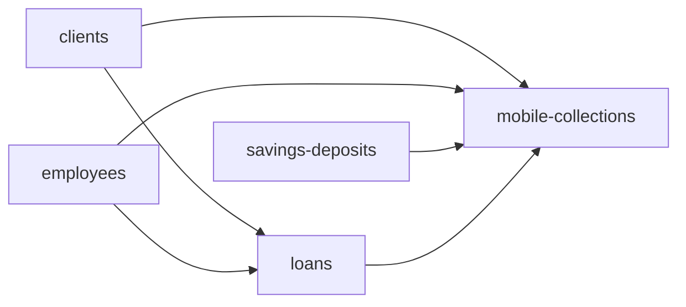

# Mobile collections implementation sequence

The Mobile Collections service has completed its local implementation and
acceptance gates. It is registered as `available` and executable. Production
still requires a fresh target-specific inspection, plan, reviewed apply, and
reconciliation after its dependency blocks are populated on that target.

## Current cross-service status — 2026-08-31

**The Mobile Collections metadata engine is complete in isolation; the full
Loans-to-Mobile-Collections sequence is not complete.** Local acceptance proved
the metadata-only writer, reconciliation, reviewed quarantines, and idempotency
against a target with only partial native loan and repayment coverage. It did
not prove complete repayment linking for the full source population.

The remaining work is owned by the sequence boundary:

- Loans must first close its reopened Gate 5 with a clean full supported-
  population reconciliation and unchanged replay.
- Clients, employees, savings accounts, loans, and source-identified loan
  repayments must all be complete on the same selected target.
- A new Mobile Collections plan must then deterministically fill all links that
  become resolvable; missing repayments must be fixed by Loans, never created
  or inferred by this service.
- Mobile Collections must reconcile all five metadata entities, reviewed
  quarantines and batch variances, exact linked repayment amounts, and zero
  native financial writes, followed by a zero-write second plan.

Until these steps pass, describe Mobile Collections as **engine-complete but
downstream-link acceptance pending**, not as an end-to-end completed sync.

## Gate 1: source extraction and identities — completed

The read-only extractor covers the complete operational domain:

- 7 `MCD_RUTA` routes;
- 992 `MCD_ASIGNACION_RUTA` party assignments;
- 570 exact routed accounts from `dbo.cuenta`;
- 1,147 `MCD_MST_COBRODIARIO` batches; and
- 9,242 `MCD_MOV_COBRODIARIO` items with their nullable
  `MCD_MOVIMIENTOS` application bridges.

Durable source keys are frozen in [contract.md](contract.md). The collection
item uses its declared five-column primary key, not `ID_DET_COBRODIARIO` alone.
The source connector remains read-only.

## Gate 2: dependency and target contract — completed

The dependency order is:



Liquibase migrations `0291_add_arissto_mobile_collections.xml` and
`0303_add_mobile_collection_account_assignments.xml` own the five extension
tables. Migration `0305_enable_native_mobile_collection_routes.xml` makes the
Arissto route identity nullable and enforces native assignment uniqueness, so
native API-created route rows can coexist with migrated rows and are not
treated as source records.

The reviewed office crosswalk is `001 -> 1` and `002 -> 2`. Staff, clients,
loans, repayments, and savings accounts resolve only through their frozen
external identities. In particular, routed savings accounts use
`dbo.cuenta.numero_cuenta = AHO_CUENTA_AHORRO.NO_CUENTA` before constructing
the savings-service external ID.

## Gate 3: planner and metadata-only writer — completed

The CLI supports:

```bash
./arissto-sync inspect --block mobile-collections --target TARGET
./arissto-sync plan --block mobile-collections --target TARGET
./arissto-sync apply --plan PLAN_ID --target TARGET
./arissto-sync retry --run RUN_ID --failed-only --target TARGET
./arissto-sync reconcile --run RUN_ID --target TARGET
./arissto-sync status --block mobile-collections --target TARGET
```

Plans are target-scoped, source- and contract-hashed, and ordered as routes,
party assignments, routed accounts, batches, then items. Parameterized upserts
are allowlisted only for the five `credesal_mobile_collection_*` tables. The
service cannot delete rows or write native loans, repayments, journal entries,
tellers, or cashiers.

Applied items without an exact legacy bridge are preserved with a null native
transaction and an explicit status. They are never matched by amount and date.
Missing downstream native accounts or repayments are also preserved so that a
later run can fill their deterministic links after the owning service runs.

## Gate 4: controlled full local apply — completed

The accepted full local population contains 11,952 written or verified target
records:

- 7 routes;
- 988 resolvable party assignments;
- 568 resolvable routed accounts;
- 1,147 batches; and
- 9,242 collection items.

Four assignments and two routed accounts are quarantined because their source
clients do not exist in the migrated target population. These six records use
the reviewed `missing_target_client` quarantine and do not block unrelated
metadata. A different quarantine reason or an unexpected production increase
requires review.

At local acceptance time the target contained only a partial loan dependency
population: 12 migrated loan identities and 115 migrated repayment identities.
Consequently, only links whose owning native entity was present were populated;
the remainder were preserved as `UNRESOLVED_TARGET_ACCOUNT`,
`MISSING_REPAYMENT`, or `UNRESOLVED_LEGACY`. This is link incompleteness, not a
second financial lifecycle. A later plan updates the links without replaying a
payment.

## Gate 5: reconciliation and idempotency — completed

Run `6091edc29a5c452c897d1492faba9538` reconciled successfully:

- 11,952 records matched and 6 reviewed entities remained quarantined;
- all 7 route staff links resolved;
- all 1,147 responsible-staff and 1,147 promoter-staff batch links resolved;
- 35 routed accounts linked to native accounts available on the local target;
- 13 collection items linked to exact native repayment identities;
- no linked repayment amount differences were found; and
- the service created zero financial rows.

Batch/header totals are reported rather than forced. Two of 1,147 batches
differed from their preserved item sums: master `840` by USD 11.00 and master
`884` by USD 15.00. These rare operational differences are accepted under the
reviewed source-error policy and remain visible in reconciliation.

The next full plan was idempotent: 11,952 entities were unchanged, the same six
entities were quarantined, and zero writes were proposed. The 208 sync-engine
unit and safety tests passed after promotion.

## Production sequence — required independently

Local acceptance does not authorize reusing a local plan or run in production.
For production:

1. Reconcile `clients`, `employees`, `savings-deposits`, and `loans` on the
   production target.
2. Run a fresh Mobile Collections `inspect` against production.
3. Build a production-scoped full plan and review counts, link statuses, all
   quarantine reasons, and batch-total variances.
4. Apply using the exact production target fingerprint confirmation.
5. Reconcile all five metadata entities, dependency links, repayment amount
   differences, and the zero-financial-write boundary.
6. Build a second full production plan and require zero proposed writes apart
   from explicitly reviewed quarantines.

Any unexpected quarantine class, dependency regression, duplicate identity,
financial-row change, or reconciliation mismatch stops promotion.

This production order is the Mobile Collections portion of the canonical
[manual loans-to-mobile flow](../orchestration.md#current-manual-loans-to-mobile-collections-flow).
