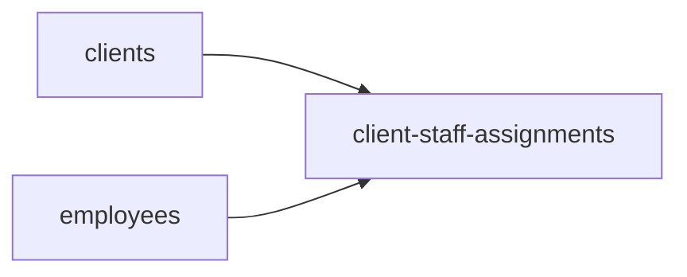
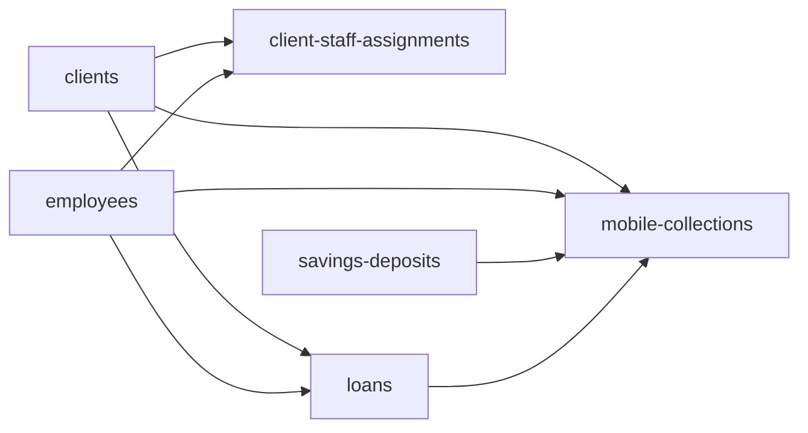

# Composed sync workflow design

This document is the canonical design for composing independently runnable
Arissto-to-Fineract services into repeatable multi-block workflows. It does not
make the sync engine a scheduler, and it does not make the proposed commands
below executable. The current CLI remains local and manually triggered until a
reviewed orchestration implementation is added.

Clean local acceptance cycles must capture and restore the disposable tenant
database as documented in
[`TEST_TENANT_RESET.md`](../../../docs/TEST_TENANT_RESET.md). Row-level cleanup
is not an orchestration service: restoring the whole pre-cycle tenant baseline
is the only supported way to remove native financial side effects exactly.

## Design goals

- Keep every service independently inspectable, plannable, applicable,
  reconcilable, and retryable.
- Reuse `registry.json` as the source of service identity, readiness, and
  dependency edges.
- Stop downstream work whenever a prerequisite plan is inapplicable, apply
  fails, or reconciliation does not match.
- Record one parent workflow run that points to every child plan, run, and
  reconciliation result.
- Make a complete unchanged daily pass successful and cheap enough to operate.
- Never weaken explicit target selection, production confirmation, source
  read-only guarantees, plan hashes, or per-service quarantine rules.

## First composed flow

The first useful workflow joins the three services already proven together:



`clients` and `employees` are independent dependency roots. The relationship
service is the fan-in node and cannot run until both roots reconcile
successfully. The first implementation should use this deterministic sequence:

1. Run one target preflight.
2. Inspect, plan, apply, and reconcile `clients`.
3. Inspect, plan, apply, and reconcile `employees`.
4. Inspect, plan, apply, and reconcile `client-staff-assignments`.
5. Emit one workflow summary and a non-zero exit status if any gate failed.

This is intentionally `clients → employees → client-staff-assignments` for the
initial version. Running the two roots concurrently is a later performance
optimization; it does not change the dependency graph.

## Current manual membership-to-native-shares flow

Membership preservation and native financial shares are separate services with
a one-way dependency. The required graph is:


The bootstrap node is not a sync service and is intentionally absent from
`registry.json`. Before running the graph, normal Fineract startup must have
applied the versioned catalog and share migrations, and configured target
offices must exist. The client contract currently maps Arissto branch `001` to
Fineract office `1` and branch `002` to office `2`; client inspection is the
runtime gate for those target prerequisites.

The deterministic manual order for one explicit target is:

1. Start Fineract and apply the versioned Liquibase prerequisites, including
   client catalogs/crosswalks and the membership/native-share support schema.
2. Run target preflight and record the target fingerprint.
3. Inspect, plan, apply, and reconcile `clients`.
4. Inspect, plan, apply, and reconcile `membership-share-capital` so the full
   legal and operational source domain is preserved before financial writes.
5. Inspect, plan, apply, and reconcile `savings-deposits` so every eligible
   native share account can select a real active same-client VISTA account.
6. Inspect and generate a fresh `native-share-capital` plan. Review its
   supported positions and explicit missing-VISTA quarantines.
7. Apply and reconcile `native-share-capital`, then generate a second plan to
   prove idempotency.

Steps 4 and 5 are independent after clients reconcile, so their relative order
does not affect correctness. They may be executed in either order, but both
must reconcile before native shares. Membership does not depend on native
shares and can be rerun safely afterward. Native shares reads its financial
projection directly from Arissto, but the registry deliberately requires the
membership preservation run first so financial projection never precedes the
lossless audit record. Employees, PEP, family references, and client-staff
assignments are not prerequisites for these two share services.

## Current manual loans-to-mobile-collections flow

The final loan and Cobro Movil migration is already executable as independent
blocks, but there is no composed workflow command. Until orchestration is
implemented, operators must execute this dependency graph manually on one
explicit target:



`clients` and `employees` are the shared dependency roots. After both have
reconciled, `client-staff-assignments` and `loans` are independent fan-out
blocks:

- `client-staff-assignments` owns the current client-level promoter, account
  executive, and collections-manager relationships from `AFI_SOCIO`;
- `loans` owns the current loan-level promoter, account executive, and
  collections-manager relationships from `CRD_CARTERA`, together with the
  native loan lifecycle; and
- neither service derives a generic Fineract loan officer or changes
  `m_staff.is_loan_officer`.

The relationship block is therefore not a prerequisite for Loans. Operators
may run the two fan-out blocks in either order after the shared roots succeed.
Running client relationships first is a reasonable presentation-oriented
convention, but it is not a dependency edge and a failure there must not be
reported as a loan prerequisite failure.

The required order is:

1. Start Fineract and apply the versioned Liquibase prerequisites, including
   `0311_add_arissto_loan_staff_assignments.xml`.
2. Run one target preflight and record its exact fingerprint.
3. Inspect, plan, apply, and reconcile `clients`.
4. Inspect, plan, apply, and reconcile `employees`.
5. After both roots succeed, independently inspect, plan, apply, and reconcile
   `client-staff-assignments` for client-level relationships. This block may be
   run before or after Loans and does not gate the loan writer.
6. Inspect and build a fresh full-scope `loans` plan for the same target. The
   plan resolves every populated `CRD_CARTERA` staff role directly through
   synchronized `m_staff.external_id`; inactive staff remain valid references,
   while genuinely missing clients or staff remain upstream prerequisite
   quarantines.
7. Review all loan actions, staff-reference quarantines, schedule variances,
   refinance graphs, and the production schedule-date gap documented in the
   loan contract.
8. Apply and reconcile `loans`; require exact source transaction identities,
   dates, totals, reversal state, terminal state, balanced journals, and exact
   current loan-level staff assignments.
9. Build a second full loan plan and require zero unintended financial or
   assignment writes.
10. Complete and reconcile `savings-deposits`; it is not a loan dependency,
    but it owns routed savings accounts consumed by Mobile Collections. It may
    run any time after Clients and before Mobile Collections.
11. Only after Clients, Employees, Loans, and Savings Deposits reconcile,
    inspect and plan `mobile-collections` against the complete native loan,
    repayment, staff, and savings identities.
12. Apply and reconcile Mobile Collections; require zero financial rows and
    review every unresolved link, quarantine, and batch-total variance.
13. Build a second full Mobile Collections plan and require zero proposed
    metadata writes apart from explicitly accepted quarantines.

Plans and runs are target-specific and cannot be reused across `local` and
`prod`. Mobile Collections never repairs a missing loan repayment: a missing
native repayment must be corrected or migrated by `loans`, then linked by a
new Mobile Collections plan. Conversely, rerunning Mobile Collections after a
loan dependency is completed updates deterministic nullable links without
posting customer cash again.

This sequence establishes the accounting boundary:

- `loans` creates every native repayment and its journal entries, including
  Cobro Movil repayments routed through `222099940104 CUOTAS PENDIENTES DE
  APLICAR`;
- the cashier's later physical-cash posting follows its normal independent
  teller/payment process; and
- `mobile-collections` stores route, batch, account-assignment, item, and
  linkage metadata only.

## Failure gates

A workflow advances past a block only when:

- inspection reports no blockers;
- the generated plan is applicable and belongs to the selected target;
- apply finishes without failed entities; quarantines are either zero or are
  explicitly permitted by the selected service contract, present in the
  reviewed plan, and accepted by reconciliation; and
- reconciliation returns `ok: true`.

An `unchanged` entity is a successful outcome. A new quarantine reason, an
unexpected increase beyond a reviewed service baseline, or a quarantine that
removes a dependency required by a downstream block remains a stopping
condition. Unattended production workflows need an explicit per-service
quarantine threshold; the existence of a historical accepted quarantine does
not authorize an unlimited one. If Clients or Employees fails, the workflow
must not attempt either Client Staff Assignments or Loans. A failure in Client
Staff Assignments does not block Loans because they are sibling fan-out blocks;
each still requires its own successful reconciliation. A retry may restart at
the failed block only after the runner verifies that every declared dependency
still reconciles on the same target. It must never silently broaden a scoped
plan into a full-block run.

## Registry and workflow responsibilities

`migration-services/registry.json` remains the catalog and dependency graph. It
must not contain schedules, credentials, mutable run state, or environment
choices.

The first implementation should add a separate machine-readable workflow
definition, for example `workflows/daily-core.json`, containing only:

- workflow ID and version;
- selected service IDs;
- deterministic ordering policy;
- full-block versus explicitly scoped mode;
- stop/retry policy; and
- whether unavailable services are rejected or skipped.

The runner should validate that selected services exist, are executable and
available, and form an acyclic graph. Dependency ordering should be derived
from the registry rather than duplicated in the workflow file.

## Proposed CLI boundary

A future CLI may expose commands shaped like:

```text
./arissto-sync workflow inspect --workflow daily-core --target TARGET
./arissto-sync workflow plan --workflow daily-core --target TARGET
./arissto-sync workflow apply --workflow-plan WORKFLOW_PLAN_ID --target TARGET
./arissto-sync workflow reconcile --workflow-run WORKFLOW_RUN_ID --target TARGET
./arissto-sync workflow status --workflow-run WORKFLOW_RUN_ID --target TARGET
```

Planning and apply should remain separate. A scheduler may invoke these commands
later, but scheduling belongs outside the Fineract runtime and outside the
individual service contracts.

## Daily automation requirements

Before unattended production use, the workflow runner needs:

- a per-target workflow lock so two daily runs cannot overlap;
- a fresh preflight and immutable target fingerprint for the complete run;
- durable parent-run state containing child plan/run IDs and timestamps;
- structured output suitable for monitoring and a non-zero failure exit code;
- a reviewed production authorization mechanism that does not bypass the
  existing fingerprint confirmation;
- a notification destination and retention policy for failures and summaries;
- a documented source-consistency policy for changes made in Arissto while a
  multi-block run is in progress; and
- bounded execution time and API/database load measurements.

Until a source watermark or snapshot contract exists, each block should plan
from a fresh source read. A mid-run Arissto change may temporarily quarantine a
new relationship whose client or employee was not present in an earlier stage;
the next daily run should converge it. The runner must report this explicitly,
not guess or create dependencies out of order.

## Smallest implementation milestone

The first orchestration implementation is complete when a local `daily-core`
workflow can run the three services above, records the parent/child run graph,
stops on a forced reconciliation failure, resumes safely without repeating
successful writes, and finishes a second complete pass with every entity
unchanged. Production scheduling and parallel root execution are later gates.
