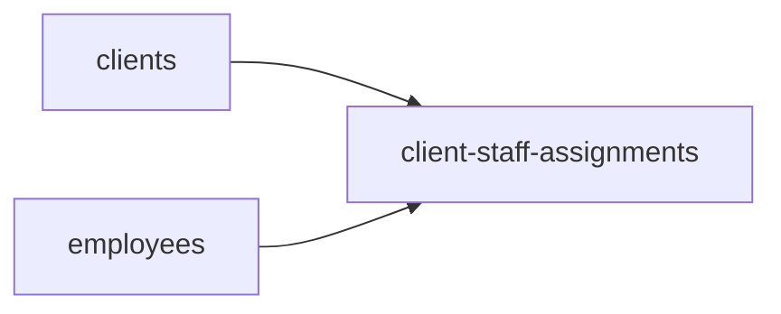
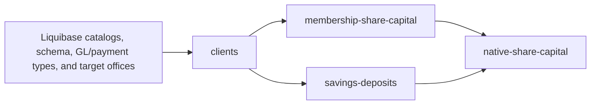
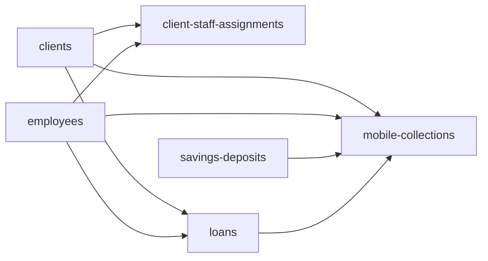

# Composed sync workflow design

This document is the canonical design for composing independently runnable
Arissto-to-Fineract services into repeatable multi-block workflows. The CLI now
implements manually started, local-only workflow planning, detached execution,
status, failure history, and resume. It remains a one-shot local process rather
than a hosted service, permanent worker, scheduler, or Fineract runtime component.

Clean local acceptance cycles must capture and restore the disposable tenant
database as documented in
[`TEST_TENANT_RESET.md`](../../../docs/TEST_TENANT_RESET.md). Row-level cleanup
is not an orchestration service: restoring the whole pre-cycle tenant baseline
is the only supported way to remove native financial side effects exactly.

## Design goals

- Keep every service independently inspectable, plannable, applicable,
  reconcilable, and retryable.
- Reuse `registry.json` as the source of service identity, readiness, and
  dependency edges.
- Stop downstream work whenever a prerequisite plan is inapplicable, apply
  fails, or reconciliation does not match.
- Record one parent workflow run that points to every child plan, run, and
  reconciliation result.
- Make a complete unchanged daily pass successful and cheap enough to operate.
- Never weaken explicit target selection, production confirmation, source
  read-only guarantees, plan hashes, or per-service quarantine rules.

## Loan runtime controls

The orchestrator freezes the loan worker and Fineract recovery policy into the
parent workflow plan. Detached execution and later resume therefore use the
same controls rather than inheriting accidental differences from the launching
shell:

```bash
./arissto-sync workflow plan --workflow WORKFLOW --cycle CYCLE --target local \
  --loan-workers 4 --fineract-pause-seconds 45 \
  --fineract-recovery-attempts 5
```

Omitted controls use two workers, a 30-second shared pause, and three
whole-loan attempts. The `.env` overrides
`ARISSTO_SYNC_LOAN_WORKERS`, `ARISSTO_SYNC_FINERACT_PAUSE_SECONDS`, and
`ARISSTO_SYNC_FINERACT_RECOVERY_ATTEMPTS` provide defaults for in-process or
legacy workflow plans that do not yet contain `runtime_controls`. New workflow
plans always persist the resolved values. The runtime adapter passes the frozen
policy only to `loans`; other service contracts remain unchanged.

## Local Fineract process recovery

Local workflow plans also freeze a bounded Fineract restart policy. When a
service step fails with a connection error, timeout, or HTTP 502/503/504, the
runner first confirms that the API is unavailable. It then runs the configured
restart command from the `fineract-core` directory, waits for an authenticated
API ping, and retries that unfinished service as a new durable step attempt.
Completed workflow steps are never repeated.

The default permits one restart and runs the guarded lifecycle helper for the
Gradle development server:

```text
./scripts/local-fineract.sh restart
```

Use `--fineract-restart-attempts 0` to disable automatic restart. The timeout
and poll interval can be set with `--fineract-restart-timeout-seconds` and
`--fineract-restart-poll-seconds`. The corresponding
`ARISSTO_SYNC_FINERACT_RESTART_*` environment values provide defaults, including
an argument-parsed command override for local setups that use another service
supervisor. Commands are executed without a shell. This recovery path is
strictly local and can never run for a production target. Legacy workflow plans
that predate this frozen policy keep automatic restart disabled; create a new
plan to opt them into process recovery.

## Accounting cutoff snapshot

The parent workflow plan also freezes one `accounting_cutoff` snapshot. Its
date defaults to the workflow-plan creation date in `America/El_Salvador`; use
`--cutoff-date YYYY-MM-DD` to override it. Every child service plan inherits
the parent value, including execution or resume after midnight.

Financial workflow definitions select `activate-frozen-plan`. Before their
first service step, the runner idempotently creates or updates a matching draft
cutoff and activates it. A matching active cutoff is reused; a mismatched active
or sealed cutoff stops the workflow before financial writes.

## Workflow-scoped target prerequisites

The frozen workflow definitions declare the Fineract financial activity mappings
required by their selected services. Native loan refinancing requires activity
`100` (`ASSET_TRANSFER`) to use active detail asset account `1510`
(`transferencias`). Savings and fixed-deposit transfers require activity `200`
(`LIABILITY_TRANSFER`) to use active detail liability account `2130050101`
(`transitorias`). These are intentionally orchestration prerequisites instead of
tenant Liquibase seeds because not every tenant is guaranteed to own the Credesal
chart of accounts.

Before creating any child service plan, the runner resolves the account by GL
code through the Fineract API. If the account exists with the reviewed type and
usage and the activity is unmapped, the runner creates only the mapping and
verifies it by reading it back. An exact mapping is reused. A missing or
ambiguous GL account, a disabled/wrong-type account, or an existing mapping to a
different account stops the workflow without modifying the chart of accounts or
overwriting accounting configuration. The runner records a
`target-prerequisites-ready` event with `created` or `unchanged` evidence, or a
`target-prerequisite-failed` event before stopping on an invalid prerequisite.

Each prerequisite is scoped to selections that include its declaring service;
party-only and unrelated workflow subsets do not query or change financial
activity mappings. A whole-tenant baseline reset may remove either mapping, in
which case the next reviewed workflow recreates it idempotently.

The dashboard-default `local-full-sync` workflow declares both prerequisites
because it exposes loans and savings/deposits. `local-credit-collections` also
declares both, while `local-membership-financial` declares only activity `200`.
Planned, non-executable services remain outside the workflows.

## First composed flow

The first useful workflow joins the three services already proven together:



`clients` and `employees` are independent dependency roots. The relationship
service is the fan-in node and cannot run until both roots reconcile
successfully. The first implementation should use this deterministic sequence:

1. Run one target preflight.
2. Inspect, plan, apply, and reconcile `clients`.
3. Inspect, plan, apply, and reconcile `employees`.
4. Inspect, plan, apply, and reconcile `client-staff-assignments`.
5. Emit one workflow summary and a non-zero exit status if any gate failed.

This is intentionally `clients → employees → client-staff-assignments` for the
initial version. Running the two roots concurrently is a later performance
optimization; it does not change the dependency graph.

## Current manual membership-to-native-shares flow

Membership preservation and native financial shares are separate services with
a one-way dependency. The required graph is:



The bootstrap node is not a sync service and is intentionally absent from
`registry.json`. Before running the graph, normal Fineract startup must have
applied the versioned catalog and share migrations, and configured target
offices must exist. The client contract currently maps Arissto branch `001` to
Fineract office `1` and branch `002` to office `2`; client inspection is the
runtime gate for those target prerequisites.

The deterministic manual order for one explicit target is:

1. Start Fineract and apply the versioned Liquibase prerequisites, including
   client catalogs/crosswalks and the membership/native-share support schema.
2. Run target preflight and record the target fingerprint.
3. Inspect, plan, apply, and reconcile `clients`.
4. Inspect, plan, apply, and reconcile `membership-share-capital` so the full
   legal and operational source domain is preserved before financial writes.
5. Inspect, plan, apply, and reconcile `savings-deposits` so every eligible
   native share account can select a real active same-client VISTA account.
6. Inspect and generate a fresh `native-share-capital` plan. Review its
   supported positions and explicit missing-VISTA quarantines.
7. Apply and reconcile `native-share-capital`, then generate a second plan to
   prove idempotency.

Steps 4 and 5 are independent after clients reconcile, so their relative order
does not affect correctness. They may be executed in either order, but both
must reconcile before native shares. Membership does not depend on native
shares and can be rerun safely afterward. Native shares reads its financial
projection directly from Arissto, but the registry deliberately requires the
membership preservation run first so financial projection never precedes the
lossless audit record. Employees, PEP, family references, and client-staff
assignments are not prerequisites for these two share services.

## Current manual loans-to-mobile-collections flow

The final loan and Cobro Movil migration is executable through the local-only
`local-credit-collections` workflow. During controlled acceptance, the workflow
may run Loans while its registry status remains `blocked` because the service is
still explicitly `executable`; the workflow plan records this as an allowed
readiness warning. This does not promote Loans to `available`, bypass inspection
or reconciliation, or permit a non-executable service to run.



`clients` and `employees` are the shared dependency roots. After both have
reconciled, `client-staff-assignments` and `loans` are independent fan-out
blocks:

- `client-staff-assignments` owns the current client-level promoter, account
  executive, and collections-manager relationships from `AFI_SOCIO`;
- `loans` owns the current loan-level promoter, account executive, and
  collections-manager relationships from `CRD_CARTERA`, together with the
  native loan lifecycle; and
- neither service derives a generic Fineract loan officer or changes
  `m_staff.is_loan_officer`.

The relationship block is therefore not a prerequisite for Loans. Operators
may run the two fan-out blocks in either order after the shared roots succeed.
Running client relationships first is a reasonable presentation-oriented
convention, but it is not a dependency edge and a failure there must not be
reported as a loan prerequisite failure.

The required order is:

1. Start Fineract and apply the versioned Liquibase prerequisites, including
   `0311_add_arissto_loan_staff_assignments.xml`.
2. Run one target preflight and record its exact fingerprint.
3. Inspect, plan, apply, and reconcile `clients`.
4. Inspect, plan, apply, and reconcile `employees`.
5. After both roots succeed, independently inspect, plan, apply, and reconcile
   `client-staff-assignments` for client-level relationships. This block may be
   run before or after Loans and does not gate the loan writer.
6. Inspect and build a fresh full-scope `loans` plan for the same target. The
   plan resolves every populated `CRD_CARTERA` staff role directly through
   synchronized `m_staff.external_id`; inactive staff remain valid references,
   while genuinely missing clients or staff remain upstream prerequisite
   quarantines.
7. Review all loan actions, staff-reference quarantines, schedule variances,
   refinance graphs, and the production schedule-date gap documented in the
   loan contract.
8. Apply and reconcile `loans`; require exact source transaction identities,
   dates, totals, reversal state, terminal state, balanced journals, and exact
   current loan-level staff assignments.
9. Build a second full loan plan and require zero unintended financial or
   assignment writes.
10. Complete and reconcile `savings-deposits`; it is not a loan dependency,
    but it owns routed savings accounts consumed by Mobile Collections. It may
    run any time after Clients and before Mobile Collections.
11. Only after Clients, Employees, Loans, and Savings Deposits reconcile,
    inspect and plan `mobile-collections` against the complete native loan,
    repayment, staff, and savings identities.
12. Apply and reconcile Mobile Collections; require zero financial rows and
    review every unresolved link, quarantine, and batch-total variance.
13. Build a second full Mobile Collections plan and require zero proposed
    metadata writes apart from explicitly accepted quarantines.

Plans and runs are target-specific and cannot be reused across `local` and
`prod`. Mobile Collections never repairs a missing loan repayment: a missing
native repayment must be corrected or migrated by `loans`, then linked by a
new Mobile Collections plan. Conversely, rerunning Mobile Collections after a
loan dependency is completed updates deterministic nullable links without
posting customer cash again.

This sequence establishes the accounting boundary:

- `loans` creates every native repayment and its journal entries, including
  Cobro Movil repayments routed through `222099940104 CUOTAS PENDIENTES DE
  APLICAR`;
- the cashier's later physical-cash posting follows its normal independent
  teller/payment process; and
- `mobile-collections` stores route, batch, account-assignment, item, and
  linkage metadata only.

## Failure gates

A workflow advances past a block only when:

- inspection reports no blockers;
- the generated plan is applicable and belongs to the selected target;
- apply finishes without failed entities; quarantines are either zero or are
  explicitly permitted by the selected service contract, present in the
  reviewed plan, and accepted by reconciliation; and
- reconciliation returns `ok: true`.

An `unchanged` entity is a successful outcome. A new quarantine reason, an
unexpected increase beyond a reviewed service baseline, or a quarantine that
removes a dependency required by a downstream block remains a stopping
condition. Unattended production workflows need an explicit per-service
quarantine threshold; the existence of a historical accepted quarantine does
not authorize an unlimited one. If Clients or Employees fails, the workflow
must not attempt either Client Staff Assignments or Loans. A failure in Client
Staff Assignments does not block Loans because they are sibling fan-out blocks;
each still requires its own successful reconciliation. A retry may restart at
the failed block only after the runner verifies that every declared dependency
still reconciles on the same target. It must never silently broaden a scoped
plan into a full-block run.

## Registry and workflow responsibilities

`migration-services/registry.json` remains the catalog and dependency graph. It
must not contain schedules, credentials, mutable run state, or environment
choices.

The first implementation should add a separate machine-readable workflow
definition, for example `workflows/daily-core.json`, containing only:

- workflow ID and version;
- selected service IDs;
- deterministic ordering policy;
- full-block versus explicitly scoped mode;
- stop/retry policy; and
- whether unavailable services are rejected or skipped.

The runner should validate that selected services exist, are executable and
available, and form an acyclic graph. Dependency ordering should be derived
from the registry rather than duplicated in the workflow file.

## Local CLI boundary

The local CLI exposes:

```text
./arissto-sync workflow list
./arissto-sync workflow inspect --workflow local-party-profile
./arissto-sync workflow cycle create --cycle CYCLE_ID --baseline-ref BASELINE_REF --target local
./arissto-sync workflow plan --workflow local-party-profile --cycle CYCLE_ID --target local
./arissto-sync workflow plan --workflow local-credit-collections --include-service loans --cycle CYCLE_ID --target local
./arissto-sync workflow start --workflow-plan WORKFLOW_PLAN_ID --cycle CYCLE_ID --target local
./arissto-sync workflow status --workflow-run WORKFLOW_RUN_ID --cycle CYCLE_ID --target local
./arissto-sync workflow resume --workflow-run WORKFLOW_RUN_ID --cycle CYCLE_ID --target local
./arissto-sync workflow history --workflow local-party-profile --target local
./arissto-sync workflow stop --workflow-run WORKFLOW_RUN_ID --cycle CYCLE_ID --target local
./arissto-sync workflow cycle close --cycle CYCLE_ID
```

Planning and execution remain separate. A workflow plan freezes the definition,
ordered service list, target fingerprint, and preflight result. Each child service
still performs a fresh `inspect → plan → apply → reconcile` sequence during
execution so downstream plans observe successfully synchronized dependencies.

`--include-service` narrows a workflow plan to one or more selected outcomes.
The planner computes their transitive registry dependency closure and freezes
both `requested_services` and `included_services` in the plan definition. A
Loans-only selection therefore contains `clients → employees → loans`; it does
not include sibling or downstream services such as Savings Deposits or Mobile
Collections. A selected service cannot omit a registry prerequisite, and the
selection never expands beyond the services declared by its base workflow.

Every plan belongs to a named sync cycle. A cycle represents one uninterrupted
lifetime of a specific local target baseline and has its own SQLite file. Restoring
or recreating the disposable tenant requires a new cycle; continuing an existing
target uses the same cycle. Old cycle databases remain preserved for analysis and
must never supply mappings to a new target lifetime.

The local dashboard's **New run** action always creates a fresh cycle. The
operator can confirm an already-restored baseline or request the optional
whole-tenant reset. That reset requires a disposable non-default tenant and the
exact `TENANT:DATABASE` confirmation, refuses active workflows, stops Fineract,
runs the existing snapshot restore tool, restarts Fineract, and verifies API
readiness before cycle creation. After plan review, approval calls `start`
immediately.

The same optional step is available from the orchestrator CLI:

```bash
./arissto-sync workflow cycle create \
  --cycle CYCLE_ID --baseline-ref BASELINE_REF --target local \
  --reset-tenant sandbox --reset-confirm sandbox:fineract_sandbox
```

`ARISSTO_SYNC_FINERACT_STOP_COMMAND` and the existing restart command configure
local process control. Their defaults use `scripts/local-fineract.sh`, which
only stops a Fineract `ServerApplication` running from this checkout and starts
it again through `./gradlew devRun`. The database restore remains exclusively
owned by `scripts/reset-test-tenant.sh`. No reset option exists for production
or the default tenant.

`start` launches a detached one-shot process and immediately returns the workflow
run ID. It does not install or start a permanent service. Scheduling, if ever
needed, remains outside the Fineract runtime and individual service contracts.

## Durable crash and failure state

Each cycle's local SQLite state database stores workflow plans, parent
runs, step attempts, failures, causal links, and an append-only `workflow_events`
trace. The event trace is scoped by `workflow_run_id` and records run creation,
runner start/finish, step creation, phase transitions, child plan/run attachment,
completion, failure, dependency blocking, retry creation, and completed-step
skips during resume. Each event includes its service, step attempt, phase,
status/severity, bounded error information, optional opaque source key, JSON
details, and a monotonically increasing SQLite sequence for deterministic replay.
`workflow status` returns both `events` and `event_links` with the existing run,
steps, and failure views.

Each item-level failure records:

- workflow run and step attempt;
- service ID and phase (`inspect`, `plan`, `apply`, `reconcile`, or dependency gate);
- the existing opaque Arissto `source_key`, when one is available;
- item status, error code, a bounded error message, and timestamps; and
- a deterministic fingerprint for comparing recurrence across workflow runs.

Plan quarantines and blocked actions are recorded before apply. Failed,
quarantined, and dependency-blocked child run items are copied into the workflow
failure index after apply. When a blocked item names another failed item in the
frozen plan's `depends_on`, the two are linked through `blocked-by`. A dependent
service that cannot start gets a service-level failure linked to every known
upstream cause through `blocked-by`; exact source keys repeated in
an ancestor and descendant service are linked as `same-source-key`. Version 1 does
not infer identity when two services use different source-key shapes.
Every new `workflow_failures` row also creates a corresponding failure event.
`workflow_event_links` mirrors failure causality, supports multiple upstream
causes, and links a retry-created event to the last event of the previous step
attempt through `retry-of`. Existing cycle databases gain the new tables safely
when `State` opens them; earlier failures remain available in the legacy failure
tables but are not synthesized into historical events.

The detached runner records its PID and phase heartbeat. `workflow status`
detects a missing process and marks the parent run `interrupted`; `workflow
resume` preserves completed steps and creates a new attempt for unfinished ones.
The per-target local lock prevents overlapping workflows. Runner output is kept
under `.arissto-sync/workflow-runs/` for supplementary crash analysis.

Workflow state must not contain credentials, names, documents, addresses, source
rows, or destination payloads.

## Daily automation requirements

Before unattended production use, the workflow runner needs:

- a per-target workflow lock so two daily runs cannot overlap;
- a fresh preflight and immutable target fingerprint for the complete run;
- durable parent-run state containing child plan/run IDs and timestamps;
- structured output suitable for monitoring and a non-zero failure exit code;
- a reviewed production authorization mechanism that does not bypass the
  existing fingerprint confirmation;
- a notification destination and retention policy for failures and summaries;
- a documented source-consistency policy for changes made in Arissto while a
  multi-block run is in progress; and
- bounded execution time and API/database load measurements.

Until a source watermark or snapshot contract exists, each block should plan
from a fresh source read. A mid-run Arissto change may temporarily quarantine a
new relationship whose client or employee was not present in an earlier stage;
the next daily run should converge it. The runner must report this explicitly,
not guess or create dependencies out of order.

## Local implementation acceptance

The runner and persistence model are implemented and covered by unit tests for
dependency ordering, forced reconciliation failure, independent sibling progress,
causal failure links, dead-process detection, and safe resume without repeating a
completed sibling. Operational acceptance still requires a controlled complete
local pass and an unchanged second pass. Production orchestration, scheduling,
and parallel root execution are outside the local scope.
